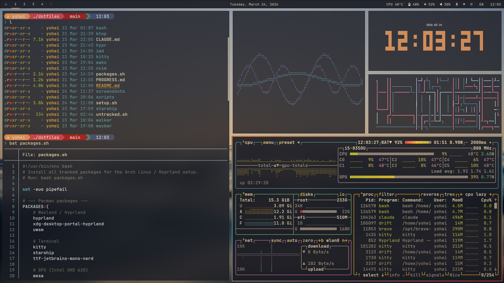
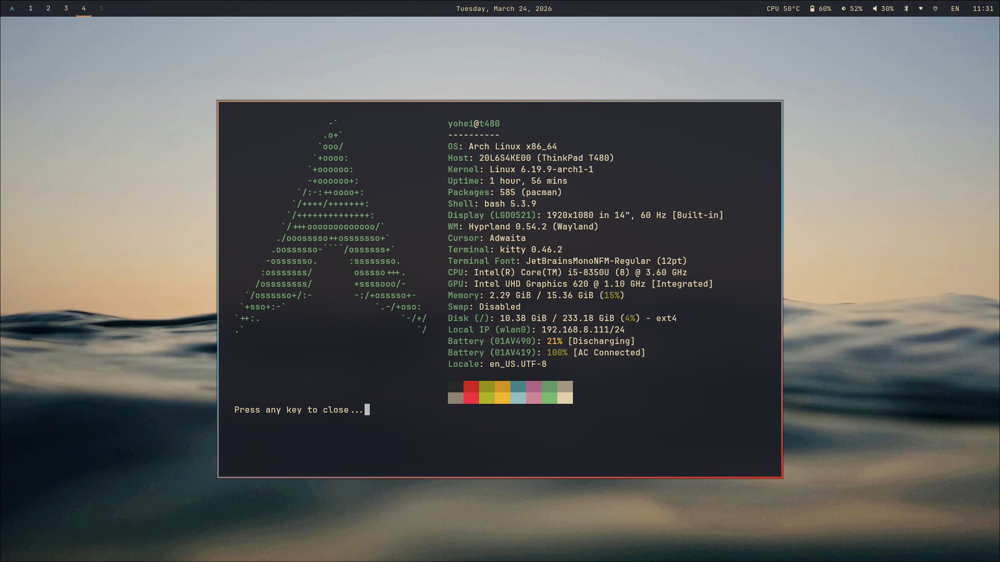
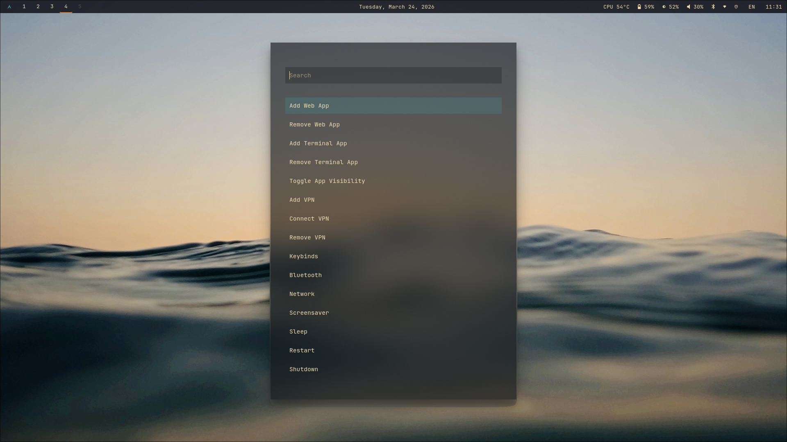

# Dotfiles — Arch Linux / Hyprland

Minimal Hyprland desktop on Arch Linux. Configs are symlinked from this repo to their expected locations.

This entire rice was built through conversation with [Claude Code](https://claude.ai/claude-code) — from package selection to config files to helper scripts. If you're curious about the CLAUDE.md that guided the process, feel free to ask.

## Screenshots


*Tiled layout with terminal, btop, tclock, and pipes*


*Floating fastfetch popup with system info*


*Command center (Super+Alt+Space) — manage apps, VPNs, and system actions*

## What's included

### Desktop environment
- **Hyprland** — tiling Wayland compositor, launched via uwsm with auto-start on TTY1 login
- **Waybar** — status bar with workspaces, clock, battery, volume, backlight, bluetooth, network, VPN status, and IME indicator
- **Mako** — notification daemon with blur and transparency
- **Walker** — app launcher (Super+Space) with custom Popping and Locking theme

### Terminal
- **Kitty** — GPU-accelerated terminal with Popping and Locking color theme and JetBrains Mono Nerd Font
- **Starship** — shell prompt with a custom warm dark palette
- **Neovim** — editor configured with lazy.nvim plugin manager and gruvbox-material theme

### Screensavers
- **Drift** — terminal screensaver with random theme cycling, triggered after 2 min shell idle
- **TTE** — system screensaver with centered ASCII art, triggered by hypridle after 5 min system idle

### Networking & VPN
- **iwd + systemd-resolved** — lightweight wireless networking (replaces NetworkManager)
- **impala** — floating TUI for managing Wi-Fi connections
- **WireGuard** — add, connect, remove, and toggle VPN configs via command center and waybar, with scoped passwordless sudo
- **OpenSSH** — SSH server enabled for remote access

### Apps & input
- **Brave** — default browser with web app support (add/remove via command center, opens in app mode)
- **Terminal apps** — add/remove terminal apps that open in kitty and appear in Walker
- **App visibility toggle** — hide/show any app in Walker via NoDisplay desktop overrides
- **fcitx5 + Mozc** — Japanese input with Super+grave toggle and waybar EN/あ indicator

### System tools
- **btop** — system monitor with custom Popping and Locking theme
- **bluetui** — bluetooth TUI manager
- **Command center** (Super+Alt+Space) — centralized dmenu for web apps, terminal apps, VPNs, keybinds, bluetooth, network, screensaver, and power actions

## Prerequisites

A working Arch Linux install with:

- A user in the `wheel` group with `sudo` access
- `git` installed (`sudo pacman -S git`)
- Internet connection (NetworkManager is fine — the setup script handles the switch)

## Install

### 1. Clone

```bash
cd ~
git clone <repo-url> dotfiles
cd dotfiles
```

### 2. Install packages

```bash
bash packages.sh
```

Installs all pacman packages, builds `yay` (AUR helper) if needed, then installs AUR packages. This will take a while on a fresh system.

### 3. Run setup

```bash
bash setup.sh
```

This script:

1. Symlinks all config directories into `~/.config/` and shell files into `~/`
2. Copies the iwd config to `/etc/iwd/`
3. **Disables NetworkManager** and enables iwd + systemd-resolved (required for impala, the network TUI)
4. **Prompts for WiFi SSID and password** — the script pauses here and won't continue until a connection is verified via ping
5. Enables bluetooth
6. Enables elephant (Walker's data provider)
7. Configures passwordless sudo for WireGuard commands
8. Enables sshd for remote access
9. Sets up XDG user directories
10. Sets Brave as the default browser

### 4. Reboot and log in

```bash
sudo reboot
```

Log in on TTY1. Hyprland starts automatically via `.bash_profile`.

## Post-setup

- Add wallpapers to `~/wallpapers/` (cycle with the wallpaper keybind)
- Add WireGuard VPN configs via the command center (Super+Alt+Space)
- Add web apps or terminal apps via the command center

## Key bindings

Once in Hyprland, open the keybinds cheat sheet from the command center (Super+Alt+Space → Keybinds).

## Structure

```
bash/           shell config (.bashrc, .bash_profile)
btop/           system monitor config + theme
hypr/           hyprland + hypridle config
iwd/            wireless daemon config
kitty/          terminal config + theme
mako/           notification daemon config
nvim/           neovim config (lazy.nvim)
scripts/        helper scripts (wallpaper, VPN, apps, screensaver, etc.)
starship/       prompt config
walker/         app launcher config + theme
waybar/         status bar config + styling
packages.sh     install all packages
setup.sh        symlink configs + bootstrap services
```
